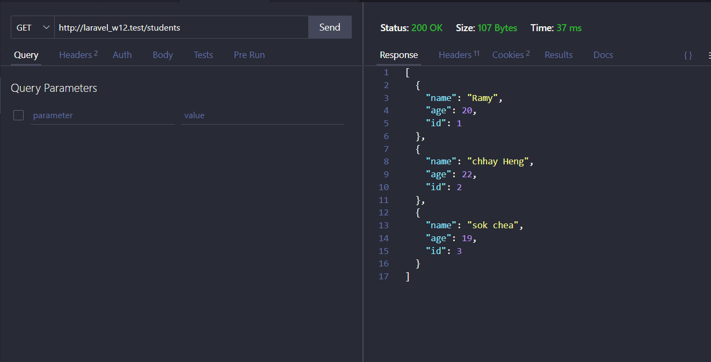
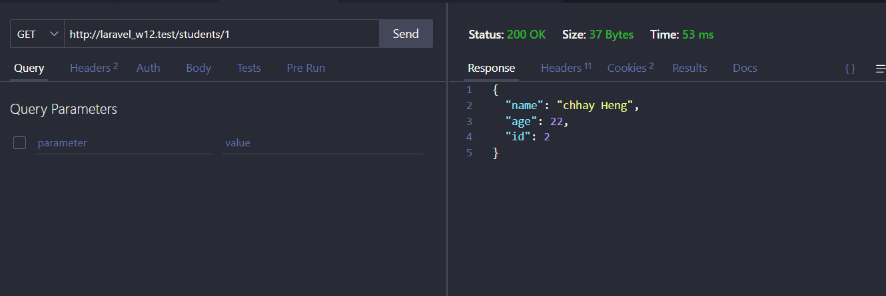
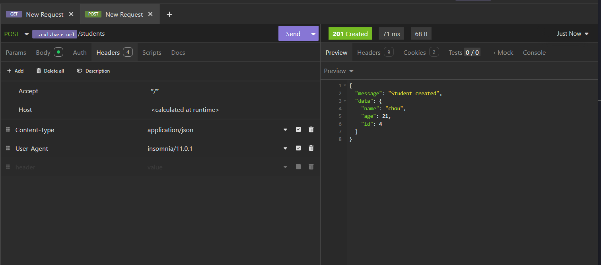
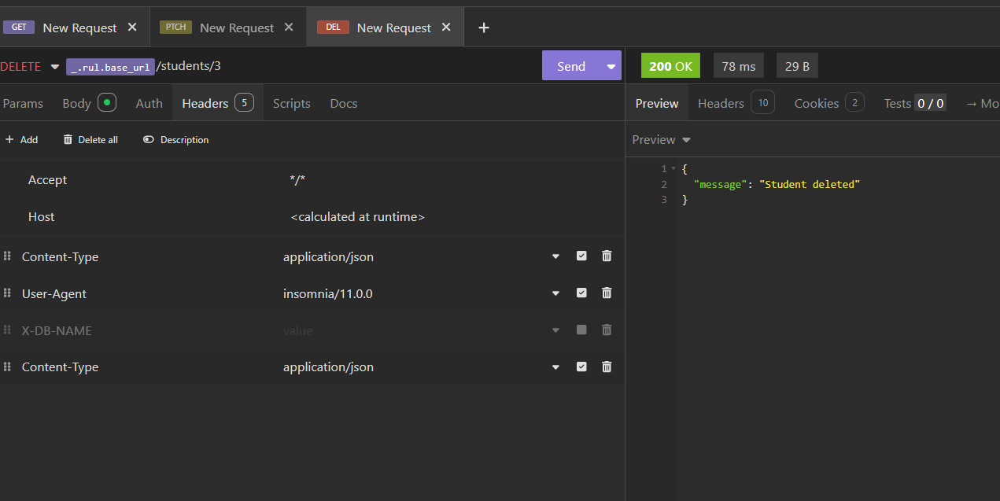
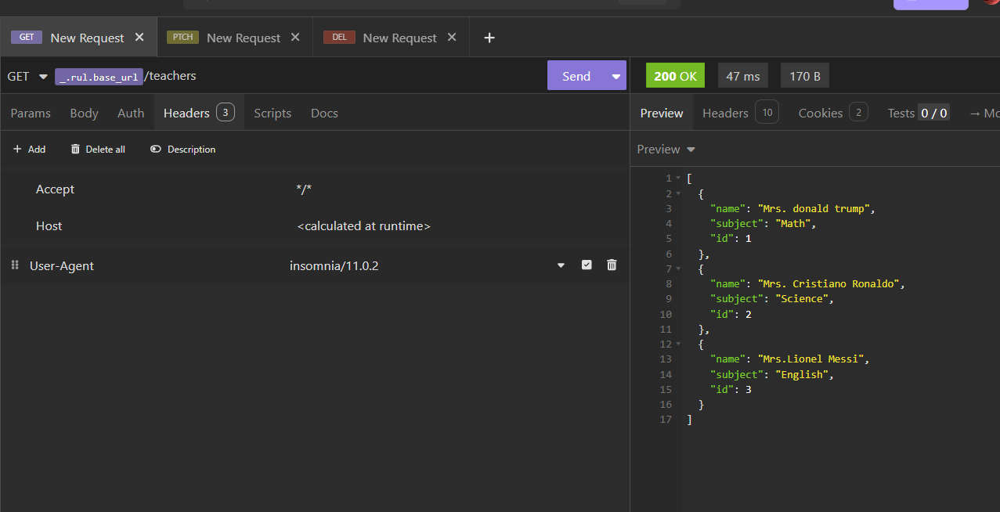
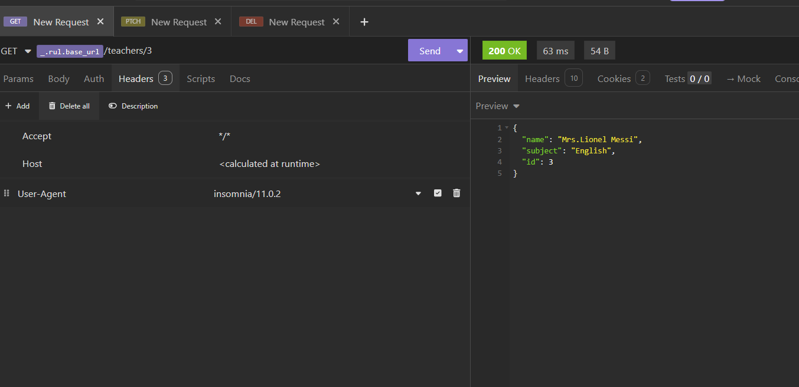
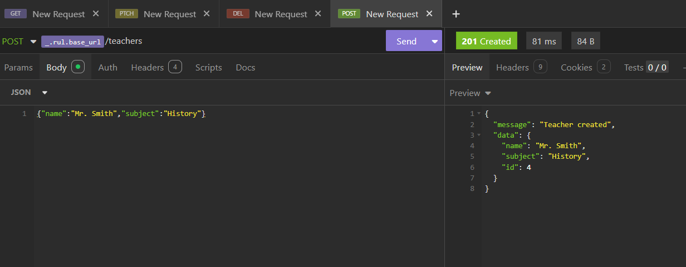
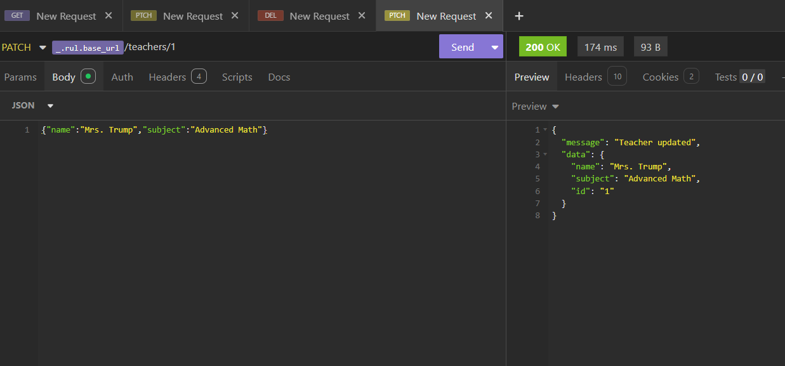
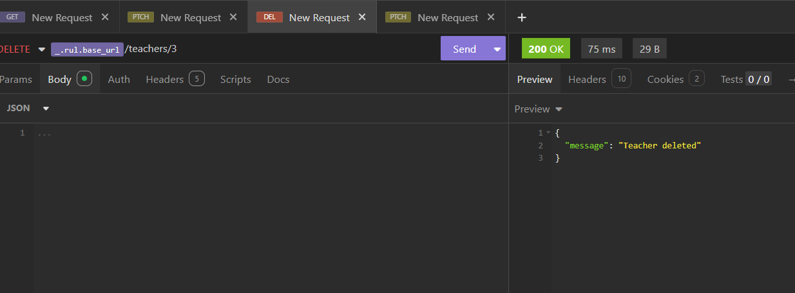

# Laravel Student API

This Laravel application provides a REST API for managing student data.

## API Endpoints

### Get All Students

The image above shows the response from the GET request to the `/students` endpoint, displaying a list of students with their name, age, and ID.

### Get Student by ID

This endpoint retrieves a specific student by their ID, returning detailed information about that student.

### Create New Student

This endpoint allows for creating a new student by sending a POST request with the student's information.

### Update Student

This endpoint enables updating a student's information using a PATCH request to modify specific fields.

### Delete Student

This endpoint removes a student from the database using their ID.

### Student Not Found

This image shows the response when attempting to retrieve a non-existent student.

## Teacher API Endpoints

### Get All Teachers

This endpoint retrieves a list of all teachers with their details.

### Get Teacher by ID

This endpoint retrieves a specific teacher's information using their ID.

### Create New Teacher

This endpoint allows for creating a new teacher by sending their information in a POST request.

### Update Teacher

This endpoint enables updating a teacher's information using a PATCH request.

### Delete Teacher

This endpoint removes a teacher from the database using their ID.
